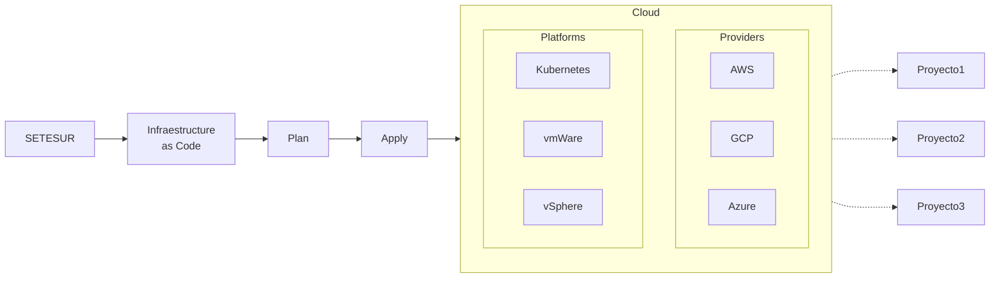

# [@CaosBinario: CURSO COMPLETO TERRAFORM](https://www.youtube.com/watch?v=_84CxYRv9Ik)


## 1. ¿Qué es Terraform?

Conceptos importantes que veremos: **Plan** y **Apply**



## 2. Demostración de Terraform

<u>Escenario</u>: Una empresa te contrata para levantar un sitio web en su cuenta de AWS. Ellos quieren levantar el servidor en una instancia de EC2. Te piden que instales un servidor web nginx, que luego ellos van a configurar. Así que te piden abrir el puerto 80 y 22 a todo el mundo.


## 3. Descargar Terraform en Windows

```ps1
winget install Hashicorp.Terraform
terraform --version
```

## 4. Herramientas

- `awscli` para interactuar con aws
- repositorio de github para subir el código fuente
  - https://github.com/caosbinario/webinar-terraform
- (opcional) **extensión de vscode** de Terraform


## 5. *Hola Mundo* en Terraform

```bash
touch main.tf
```

Nuestro primer archivo Terraform. No es necesario que se llame `main.tf`, pero sí es una buena práctica. Terraform lee automáticamente todos los archivos `.tf` del directorio.


```hcl
provider "aws" {
    region = "us-east-1"
}

resource "aws_instance" "nginx-server" {
    ami           = "ami-044...29d" # Amazon Linux
    instance_type = "t3.micro"      # 0.5 GB, 0.5 core
}
```

- `provider`: plugin que interactúa con un servicio o API específica de un proveedor de infraestructura
- `recourse`: unidad básica de configuración en Terraform; la mínima expresión

> `ami`: Amazon Image

## 6. Comandos Terraform

```bash
terraform init      # Inicializar un directorio de trabajo, descargar plugins...
tree .terraform     # Ejecutables para plugins, eg. aws

terraform plan      # Generar un plan de ejecución
                    # Salen todos los recursos, o definidos o por definir

                    # NECESARIO LOGUEARSE EN AWS PRIMERO...
terraform apply     # Aplicar los cambios definidos
                    # Ir a la web de AWS, ver instancias

# terraform destroy   # Eliminar los recursos
```

Como es IaC, commitear el código.

```bash
git add -A
git commit -m "Initial commit"
git push
```

## 7. Instalar nginx, ssh, security groups y tags con Terraform

```bash
terraform destroy
```

### nginx

```hcl
resource "foo" "bbr" {

    user_data = <<-EOF
                #!/bin/bash
                sudo yum install -y nginx
                sudo systemctl enable nginx
                sudo systemctl start nginx
                EOF

}
```

### ssh key

```bash
ssh-keygen -t rsa -b 2048 -f "nginx-server.key"
    # sin passphrase

ls nginx-server.key*
    # .key
    # .key.pub
```

```hcl
resource "aws_instance" "nginx-server" {
    key_name = aws_key_pair.nginx-server-ssh.key_name
}

resource "aws_key_pair" "nginx-server-ssh" {
    key_name   = "nginx-server-ssh"
    public_key =  file("nginx-server.key.pub")
}
```

### security groups

```hcl
resource "aws_instance" "nginx-server" {
    vpc_security_group_ids = [
        # nota: no conocemos el id, abstracción porque Terraform lo conoce via importación
	    aws_security_group.nginx-server-sg.id
    ]
}

resource "aws_security_group" "nginx-server-sg" {
    name        = "nginx-server-sg"
    description = "Security group allowing SSH and HTTP access"

    ingress {
        from_port   = 22
        to_port     = 22
        protocol    = "tcp"
        cidr_blocks = ["0.0.0.0/0"]
    }

    ingress {
        from_port   = 80
        to_port     = 80
        protocol    = "tcp"
        cidr_blocks = ["0.0.0.0/0"]
    }

    # de 0 a 0 == aceptar todos los puertos
    egress {
        from_port        = 0
        to_port          = 0
        protocol         = "-1"
        cidr_blocks      = ["0.0.0.0/0"]
    }
}
```

Aplicar

```bash
terraform apply
    # Se crean 3 recursos: el t3.micro, la llave ssh y el security group
```

Abrimos la consola de AWS y vemos la nueva instancia.

En la pestaña de Security vemos que existe uno con el nombre definido y con los puertos 22 y 80 abiertos.

En Details > Key pair vemos que existe la llave.

PROBAR A VER SI FUNCIONA.

Abrir dirección de la IP pública

```bash
curl <IP>:80
    # Welcome to nginx!
```

Commitear código.

### tags

Para identificar las Instancias en la consola de AWS.

```hcl
resource "aws_instance" "nginx-server" {
    tags = {
        Name        = "nginx-server"
        Environment = "test"

        # El nuestro independiente del cliente en cuyo nombre hacemos el despliegue
        Owner       = "ariel.molina@caosbinario.com"
        Team        = "DevOps"
        Project     = "webinar"
    }
}

resource "aws_key_pair" "nginx-server-ssh" {
    tags = {
        Name        = "nginx-server-ssh"
        Environment = "test"
        Owner       = "ariel.molina@caosbinario.com"
        Team        = "DevOps"
        Project     = "webinar"
    }
}

resource "aws_security_group" "nginx-server-sg" {
    tags = {
        Name        = "nginx-server-sg"
        Environment = "test"
        Owner       = "ariel.molina@caosbinario.com"
        Team        = "DevOps"
        Project     = "webinar"
    }
}
```

Ver diff de lo que sucederá con respecto a los recursos existentes

```bash
terraform plan
terraform apply
```

Ver los cambios en AWS.

Commitear código.

## 8. Output en Terraform
## 9. Variables en Terraform
## 10. Separar archivos en Terraform
## 11. Módulos en Terraform
## 12. Importar recursos existentes a Terraform
## 13. Buenas prácticas Terraform
## 14. Final